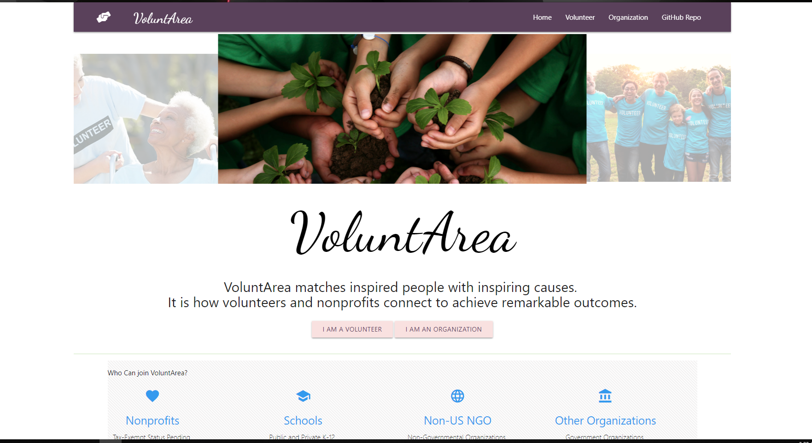

# VoluntArea
noun  vol·un·tar·ea  \ ˌvä-lən-ˈter-ē-ə\  

An app that connects nonprofit organizations with potential volunteers. Organizations will post their volunteer needs for events on specific dates.  

“I would totally use this app. Finding volunteer work can be surprisingly difficult!” 
~ Nicki, Kubra

“Number one app in the industry!  VoluntArea will revolutionize the non-profit industry!”
~ Abby, Derby Dames

“I can’t imagine any team coming up with a better app than this!  Incredible!”
~ Deron, Intel

## Deployment
Visit the application [https://voluntarea.herokuapp.com/](https://voluntarea.herokuapp.com/)

## Usages

VoluntArea matches inspired people with inspiring causes. 
It is how volunteers and nonprofits connect to achieve remarkable outcomes.

## Meta

Distributed under the ISC license. See ``LICENSE`` for more information.

[https://github.com/Jhint24/VoluntArea](https://github.com/jhint24/)

## Contributing

1. Fork it (<https://github.com/Jhint24/VoluntArea/fork>)

## Current Contributors

Josh @ [https://github.com/Jhint24](https://github.com/jhint24/)

Nicole @ [https://github.com/nsanta11](https://github.com/nsanta11/)

Sepideh @ [https://github.com/zahrafalah](https://github.com/zahrafalah/)

Kyle @ [https://github.com/kabrittan](https://github.com/kabrittan/)
